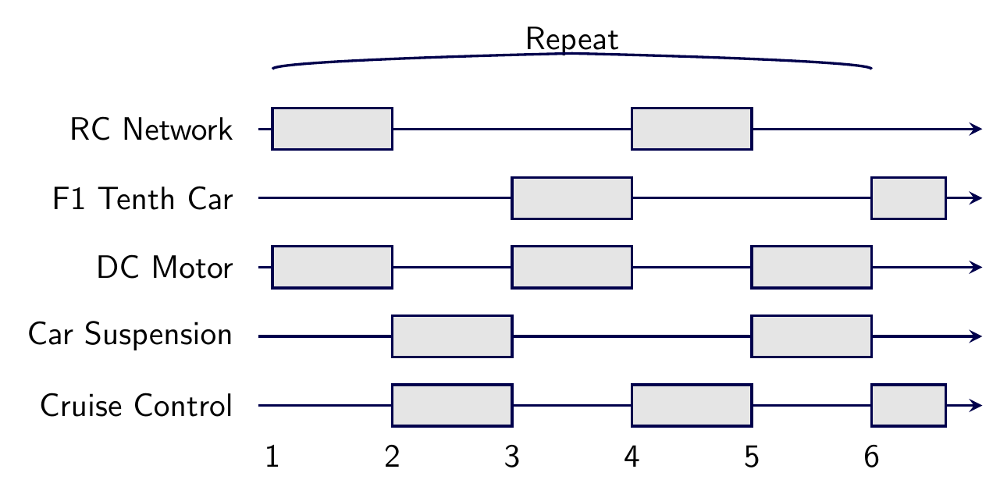
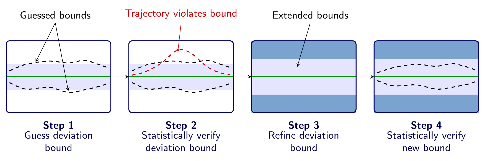

# sketch2fig

Agentic AI tool that converts figure screenshots and sketches into publication-quality TikZ code.

```
Input image → [Plan] → [Generate TikZ] → [Compile] → [Evaluate] → [Refine] → Output .tex + .png
                                               ↑                        │
                                               └──── targeted edits ────┘
```

## How It Works

1. **Plan** — A vision LLM analyzes the figure: element types, layout, connections, color semantics, and aesthetic intent
2. **Generate** — An LLM writes a `tikzpicture` from the plan, using the original image for visual detail
3. **Compile** — `pdflatex` compiles the code; on failure Claude auto-fixes errors (up to 3 retries)
4. **Evaluate** — The rendered PNG is compared against the input image; scored on completeness, structure, text accuracy, and aesthetics
5. **Refine** — If the score is below threshold, Claude makes *targeted* edits and re-compiles (up to 5 iterations)

## Requirements

- Python 3.12+
- [uv](https://docs.astral.sh/uv/) package manager
- TeX Live with `pdflatex` and `pdftoppm` (poppler)
- Anthropic API key

**macOS:**
```bash
brew install --cask mactex-no-gui   # or: brew install basictex
brew install poppler
```

**Ubuntu/Debian:**
```bash
apt-get install texlive-pictures texlive-latex-extra poppler-utils
```

## Setup

```bash
git clone https://github.com/yourname/sketch2fig
cd sketch2fig
uv sync
echo "ANTHROPIC_API_KEY=sk-..." > .env
```

## Usage

### Convert a figure

```bash
uv run sketch2fig convert screenshot.png
```

Output is written to `output/<input_stem>/`:
```
output/screenshot/
├── iter_01/figure.tex   rendered.png
├── iter_02/figure.tex   rendered.png
├── final.tex
└── final.png
```

### Flags

```bash
# Aesthetic cleanup — improve alignment and spacing even if input is imperfect
uv run sketch2fig convert sketch.png --clean

# Control max refinement iterations (default: 5)
uv run sketch2fig convert sketch.png --max-iters 3

# Custom output directory
uv run sketch2fig convert sketch.png --output-dir results/my_figure

# Verbose: show plan summary, per-iteration scores, and evaluator critique
uv run sketch2fig convert sketch.png --verbose
```

### Verbose output example

```
INFO: === Planning ===
INFO: Plan: pipeline | horizontal_flow | 4 element(s) | 3 connection(s)
INFO: Aesthetic notes: boxes appear intended to be uniformly spaced
INFO: === Generating ===
INFO: === Iteration 1/5 ===
INFO: Scores: overall=6.80 completeness=7 structure=6 text=8 aesthetic=6 — FAIL
INFO:   [MAJOR] missing_element: Step 3 box interior is empty — add smooth curve plot
INFO:   [MINOR] aesthetic: border radius inconsistent with input — use rounded corners=2pt
INFO: === Refining: 1 major, 1 minor issue(s) ===
INFO: === Iteration 2/5 ===
INFO: Scores: overall=8.45 completeness=9 structure=8 text=9 aesthetic=8 — PASS
INFO: Quality threshold reached.

Done in 2 iteration(s) — score: 8.45 — PASS
  TikZ: output/screenshot/final.tex
  PNG:  output/screenshot/final.png
```

## Examples

All four test figures come from published research papers. Results from running `sketch2fig convert` on each:

| Figure | Iterations | Score | Result |
|--------|-----------|-------|--------|
| `4_schedule.png` — Gantt-style scheduling diagram | 1 | 8.90 | ✅ PASS |
| `3_deviation.png` — Pipeline with curves and layered shading | 5 | 8.00 | near-pass |
| `2_architecture.png` — System architecture with feedback loops | 5 | 7.60 | partial |
| `1_cover_image.png` — Two-row pipeline with dashed grouping boxes | 5 | 7.30 | partial |

### Schedule diagram (PASS on first try)

| Input | Output (iter 1) |
|-------|----------------|
|  |  |

### Deviation bound pipeline (5 iterations)

| Input | Iteration 1 | Final |
|-------|------------|-------|
|  |  |  |

Run on one of these to see the full loop:

```bash
uv run sketch2fig convert tests/fixtures/real_examples/4_schedule.png --verbose
```

## Testing

```bash
# Tier 1 — fast, no LaTeX required (~2s)
uv run pytest -m "not slow"

# Tier 2 — full pipeline with pdflatex + pdftoppm (~10s)
uv run pytest

# Tier 3 — integration tests with real LLM calls (costs API credits)
uv run pytest -m integration
```

## Project Layout

```
src/sketch2fig/
├── cli.py          Typer CLI entry point
├── orchestrator.py Agentic loop (Plan→Generate→Compile→Evaluate→Refine)
├── planner.py      Image → structured JSON plan
├── generator.py    Plan → TikZ code, compile-fix, refinement
├── evaluator.py    Input vs rendered scoring
├── compiler.py     pdflatex + pdftoppm pipeline
├── prompts.py      All LLM prompt templates
└── config.py       Settings + Claude API helper
templates/
└── preamble_default.tex  Default TikZ styles and color palette
```
